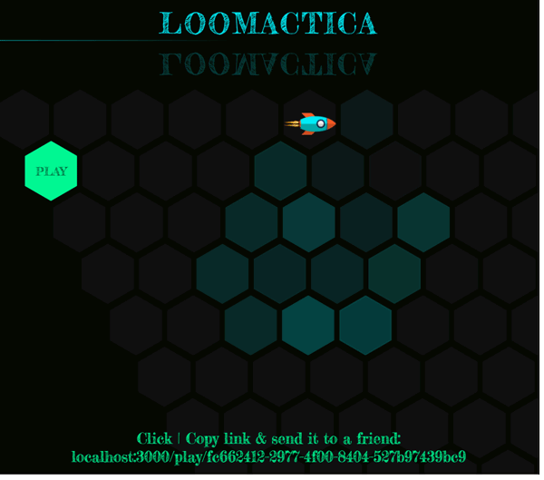

# LOOMACTICA

(Battleship-Version with Spaceships)

Still under construction!
Play with a friend this game. This time I don't build a SPA, concentrate more on Node with Handlebars.
I was interested to set up a proper, good workflow. I restructured this project several times, so in the end I used a new feature: Webpack. With Webpack I bundle the TypeScript-files for my game to serve a single static js-file and to use the predicate of the ES6 module system, besides not polluting the global namespace. SASS compiles to a CSS-file, which gets autoprefixed by Grunt.
Nice, makes sense to use this!
I have promised this game to my girlfriend for a long time, finally ...

## Tech Stack:

-   TypeScript
-   Node(Express)
-   Socket.io
-   Handlebars
-   Webpack
-   Grunt(Autoprefixer)
-   SASS

## Preview:

### Website: Missing

### Download: Missing
